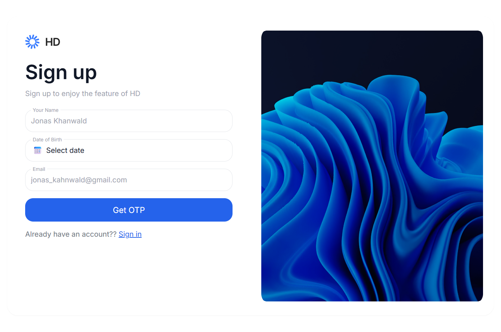
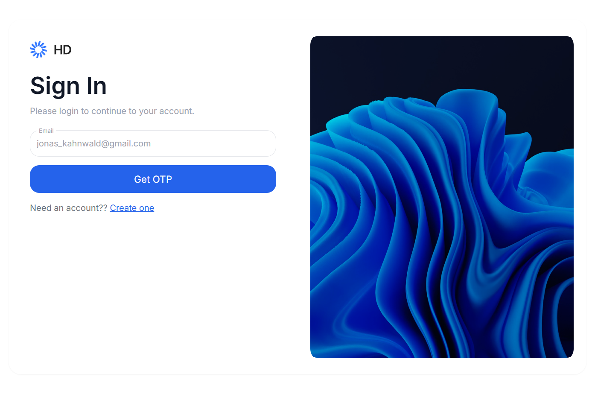
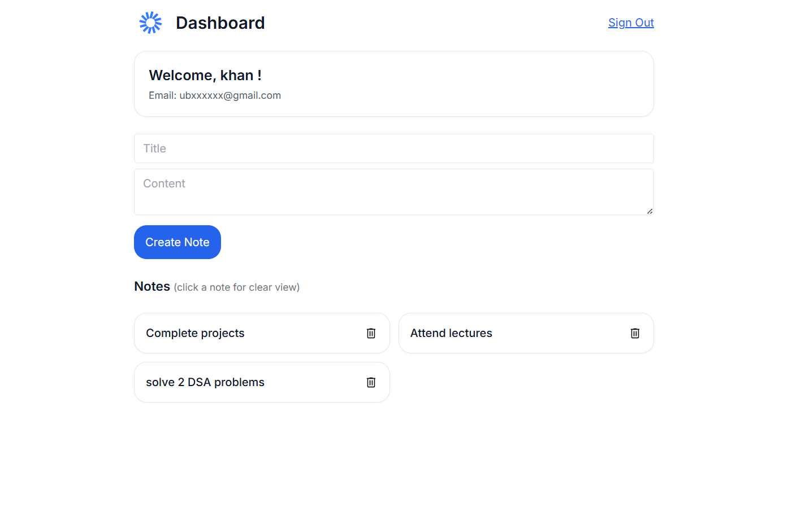

# Notes App

Modern full‑stack notes application with email OTP.

Live Link: https://notes-app-bay-two.vercel.app

## Gallery
Below are a few screenshots.

## Features
- Email OTP signup/login
- JWT-protected notes: create, list, delete
- Mobile-first UI built with Tailwind
- TypeScript across frontend and backend

## Tech Stack
- Frontend: React, TypeScript, Vite, Tailwind CSS, React Router
- Backend: Node.js, Express, TypeScript, Mongoose, JWT, Zod
- Database: MongoDB

## Getting Started
See `frontend/README.md` and `backend/README.md` for detailed steps.

### Local development
Prerequisites: Node 18+, MongoDB (local or remote), Google OAuth Client ID (optional).

Backend
- Copy `backend/.env.example` to `backend/.env` and fill values
- Run: `cd backend && npm install && npm run dev`

Frontend
- Copy `frontend/.env.example` to `frontend/.env` and set `VITE_API_URL`
- Run: `cd frontend && npm install && npm run dev`
- Open http://localhost:5173

## Project Structure
- `frontend/` – React client
- `backend/` – Express API

## Deployment
- Frontend: Vercel (static build from `frontend`)
- Backend: Render (Node runtime from `backend`)

